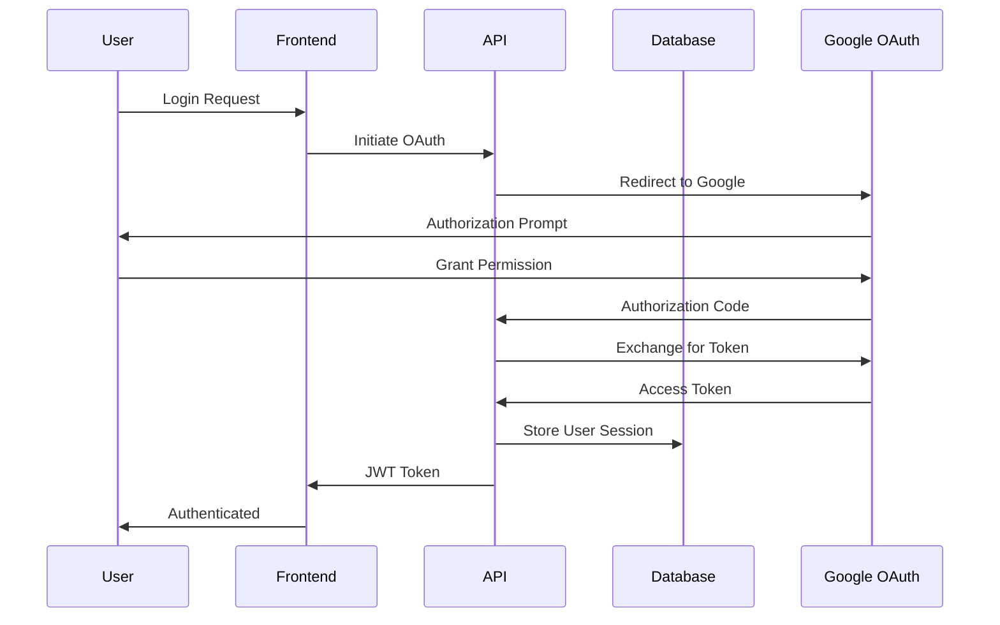

# YTEmpire System Architecture Overview

## Executive Summary

YTEmpire is a microservices-based YouTube analytics and content management platform built with scalability, maintainability, and performance in mind. The architecture follows cloud-native principles with containerized services, API-first design, and separation of concerns.

## Table of Contents
- [Architecture Principles](#architecture-principles)
- [System Components](#system-components)
- [Data Flow](#data-flow)
- [Technology Stack](#technology-stack)
- [Service Architecture](#service-architecture)
- [Security Architecture](#security-architecture)
- [Scalability Strategy](#scalability-strategy)

## Architecture Principles

### Core Principles
1. **Microservices Architecture**: Independent, loosely coupled services
2. **API-First Design**: RESTful APIs with OpenAPI documentation
3. **Container-Based Deployment**: Docker containers for all services
4. **Database per Service**: Each service owns its data schema
5. **Event-Driven Communication**: Asynchronous messaging where appropriate
6. **Security by Design**: Authentication, authorization, and encryption built-in

### Design Patterns
- **API Gateway Pattern**: Nginx as reverse proxy
- **Database Sharding**: Partitioned analytics tables
- **Cache-Aside Pattern**: Redis for performance optimization
- **Circuit Breaker**: Resilient external API calls
- **CQRS**: Separate read/write models for analytics

## System Components

### High-Level Architecture Diagram

```
┌─────────────────────────────────────────────────────────────────────────┐
│                              Internet                                   │
└────────────────────────────┬───────────────────────────────────────────┘
                             │
                    ┌────────▼────────┐
                    │   Cloudflare    │
                    │   CDN & WAF     │
                    └────────┬────────┘
                             │
                    ┌────────▼────────┐
                    │   Nginx Proxy   │
                    │   (SSL/Load     │
                    │    Balancing)   │
                    └───┬─────────┬───┘
                        │         │
            ┌───────────▼───┐ ┌───▼───────────┐
            │   Frontend    │ │  Backend API  │
            │   (React/     │ │  (Node.js/    │
            │    Next.js)   │ │   Express)    │
            └───────────────┘ └───┬───────┬───┘
                                  │       │
                      ┌───────────▼───┐ ┌─▼──────────┐
                      │  PostgreSQL   │ │   Redis    │
                      │   Database    │ │   Cache    │
                      └───────┬───────┘ └────────────┘
                              │
                  ┌───────────▼────────────┐
                  │   External Services    │
                  ├──────────────────────── │
                  │ • YouTube Data API     │
                  │ • YouTube Analytics    │
                  │ • OAuth 2.0 Provider   │
                  │ • Email Service        │
                  └────────────────────────┘
```

### Component Descriptions

#### 1. Frontend Layer
**Technology**: React with Next.js  
**Purpose**: User interface and client-side logic  
**Key Features**:
- Server-side rendering (SSR) for SEO
- Progressive Web App (PWA) capabilities
- Real-time updates via WebSockets
- Responsive design for all devices
- Component-based architecture

#### 2. API Gateway (Nginx)
**Technology**: Nginx  
**Purpose**: Request routing and load balancing  
**Key Features**:
- SSL/TLS termination
- Request/response caching
- Rate limiting
- Load balancing
- Static file serving
- WebSocket proxy

#### 3. Backend API Layer
**Technology**: Node.js with Express  
**Purpose**: Business logic and API services  
**Key Features**:
- RESTful API endpoints
- JWT authentication
- Request validation
- Business rule enforcement
- External API integration
- WebSocket server for real-time updates

#### 4. Database Layer
**Technology**: PostgreSQL 15  
**Purpose**: Persistent data storage  
**Key Features**:
- Multi-schema architecture
- ACID compliance
- Time-series data partitioning
- Full-text search capabilities
- JSON/JSONB support for flexible data
- Automated backups

#### 5. Cache Layer
**Technology**: Redis 7  
**Purpose**: Performance optimization  
**Key Features**:
- Session storage
- API response caching
- Rate limiting counters
- Real-time analytics
- Pub/Sub for events
- Queue management

#### 6. External Services
**Integrations**:
- YouTube Data API v3
- YouTube Analytics API
- Google OAuth 2.0
- SendGrid/MailHog (email)
- Stripe (future payments)

## Data Flow

### Request Flow Diagram

```
User Request → CDN → Nginx → Backend API → Service Layer
                                   ↓
                              Data Layer
                                   ↓
                         [PostgreSQL | Redis]
                                   ↓
                              Response
                                   ↓
                         Transform & Validate
                                   ↓
                            Return to User
```

### Authentication Flow



### Data Processing Flow

1. **Data Ingestion**
   - YouTube API polling
   - Webhook listeners
   - User uploads

2. **Processing Pipeline**
   - Validation
   - Transformation
   - Enrichment
   - Storage

3. **Analytics Generation**
   - Aggregation
   - Calculation
   - Caching
   - Delivery

## Technology Stack

### Frontend Technologies
| Technology | Version | Purpose |
|------------|---------|---------|
| React | 18.x | UI Framework |
| Next.js | 13.x | React Framework |
| TypeScript | 5.x | Type Safety |
| Tailwind CSS | 3.x | Styling |
| Redux Toolkit | 1.9.x | State Management |
| Socket.io Client | 4.x | WebSockets |
| Chart.js | 4.x | Data Visualization |

### Backend Technologies
| Technology | Version | Purpose |
|------------|---------|---------|
| Node.js | 18 LTS | Runtime |
| Express | 4.x | Web Framework |
| TypeScript | 5.x | Type Safety |
| Sequelize | 6.x | ORM |
| Socket.io | 4.x | WebSockets |
| Bull | 4.x | Job Queue |
| Winston | 3.x | Logging |

### Infrastructure Technologies
| Technology | Version | Purpose |
|------------|---------|---------|
| Docker | 20.10+ | Containerization |
| Docker Compose | 2.x | Orchestration |
| PostgreSQL | 15 | Database |
| Redis | 7 | Cache/Queue |
| Nginx | 1.24 | Proxy/LB |
| pgAdmin | 4 | DB Management |

## Service Architecture

### Microservices Breakdown

#### Core Services

1. **Authentication Service**
   - User registration/login
   - JWT token management
   - OAuth integration
   - Password reset
   - Session management

2. **Channel Service**
   - Channel CRUD operations
   - Channel synchronization
   - Ownership management
   - Settings configuration

3. **Content Service**
   - Video management
   - Playlist operations
   - Content scheduling
   - Metadata management

4. **Analytics Service**
   - Data aggregation
   - Report generation
   - Real-time metrics
   - Historical analysis

5. **Campaign Service**
   - Campaign creation
   - Performance tracking
   - A/B testing
   - ROI calculation

6. **Notification Service**
   - Email notifications
   - In-app notifications
   - Push notifications
   - Webhook delivery

### Service Communication

```yaml
Communication Patterns:
  Synchronous:
    - REST APIs for CRUD operations
    - GraphQL for complex queries (future)
  
  Asynchronous:
    - Redis Pub/Sub for events
    - Bull queues for jobs
    - WebSockets for real-time
```

## Database Architecture

### Schema Design

```sql
-- Logical Schema Separation
ytempire_dev/
├── users/          # User management
│   ├── accounts
│   ├── profiles
│   └── sessions
├── content/        # YouTube content
│   ├── channels
│   ├── videos
│   ├── playlists
│   └── playlist_videos
├── analytics/      # Performance data
│   ├── channel_analytics
│   ├── video_analytics
│   ├── audience_demographics
│   └── traffic_sources
├── campaigns/      # Marketing
│   ├── campaigns
│   ├── campaign_videos
│   └── campaign_performance
└── system/         # Configuration
    ├── api_keys
    └── sync_logs
```

### Data Partitioning Strategy

```sql
-- Time-based partitioning for analytics
CREATE TABLE analytics.video_analytics (
    id UUID PRIMARY KEY,
    video_id UUID NOT NULL,
    date DATE NOT NULL,
    views INTEGER,
    watch_time INTEGER,
    ...
) PARTITION BY RANGE (date);

-- Monthly partitions
CREATE TABLE analytics.video_analytics_2025_01 
    PARTITION OF analytics.video_analytics
    FOR VALUES FROM ('2025-01-01') TO ('2025-02-01');
```

## Security Architecture

### Security Layers

1. **Network Security**
   - Cloudflare DDoS protection
   - SSL/TLS encryption
   - Firewall rules
   - Private subnets

2. **Application Security**
   - JWT authentication
   - Role-based access control (RBAC)
   - Input validation
   - SQL injection prevention
   - XSS protection
   - CSRF tokens

3. **Data Security**
   - Encryption at rest
   - Encryption in transit
   - Secure key management
   - PII data masking
   - Audit logging

### Authentication & Authorization

```javascript
// JWT Token Structure
{
  "sub": "user_uuid",
  "email": "user@example.com",
  "roles": ["user", "admin"],
  "channels": ["channel_id_1", "channel_id_2"],
  "iat": 1234567890,
  "exp": 1234567890
}

// Permission Model
Permissions:
  - channel:read
  - channel:write
  - analytics:read
  - campaign:create
  - admin:all
```

## Scalability Strategy

### Horizontal Scaling

```yaml
Scaling Approach:
  Frontend:
    - Multiple container instances
    - CDN for static assets
    - Edge caching
  
  Backend:
    - Stateless API servers
    - Load balancer distribution
    - Auto-scaling based on CPU/memory
  
  Database:
    - Read replicas
    - Connection pooling
    - Query optimization
  
  Cache:
    - Redis Cluster
    - Partition by key space
```

### Performance Optimization

1. **Caching Strategy**
   - CDN for static assets
   - Redis for API responses
   - Browser caching headers
   - Database query caching

2. **Database Optimization**
   - Indexed columns
   - Materialized views
   - Query optimization
   - Connection pooling

3. **API Optimization**
   - Response compression
   - Pagination
   - Field filtering
   - Batch operations

## Monitoring & Observability

### Monitoring Stack

```yaml
Metrics Collection:
  - Prometheus for metrics
  - Grafana for visualization
  - Elasticsearch for logs
  - Kibana for log analysis
  - Jaeger for distributed tracing

Key Metrics:
  - API response times
  - Error rates
  - Database query performance
  - Cache hit ratios
  - YouTube API quota usage
  - User activity patterns
```

### Health Checks

```javascript
// Health Check Endpoints
GET /health         # Basic health
GET /health/ready   # Readiness probe
GET /health/live    # Liveness probe
GET /health/deps    # Dependency health

// Response Format
{
  "status": "healthy",
  "timestamp": "2025-01-01T00:00:00Z",
  "services": {
    "database": "healthy",
    "redis": "healthy",
    "youtube_api": "healthy"
  },
  "metrics": {
    "uptime": 86400,
    "memory_usage": "45%",
    "cpu_usage": "23%"
  }
}
```

## Deployment Architecture

### Development Environment
- Docker Compose for local development
- Hot reloading for rapid iteration
- Local database with seed data
- MailHog for email testing

### Staging Environment
- Kubernetes cluster
- Replica of production
- Automated testing
- Performance profiling

### Production Environment
- Kubernetes on AWS/GCP
- Multi-region deployment
- Auto-scaling groups
- Blue-green deployments
- Automated backups

## Future Enhancements

### Planned Improvements
1. **GraphQL API** - For flexible queries
2. **Microservices Mesh** - Service-to-service communication
3. **Event Sourcing** - Audit trail and replay
4. **CQRS Implementation** - Separate read/write models
5. **Machine Learning** - Predictive analytics
6. **Multi-tenancy** - Agency support
7. **Mobile Apps** - iOS/Android clients
8. **Webhook System** - Third-party integrations

## Conclusion

The YTEmpire architecture is designed to be:
- **Scalable**: Horizontal scaling capability
- **Maintainable**: Clean separation of concerns
- **Secure**: Multiple security layers
- **Performant**: Optimized for speed
- **Reliable**: Fault-tolerant design
- **Observable**: Comprehensive monitoring

This architecture provides a solid foundation for building a production-ready YouTube analytics platform that can grow with user demands.

---

[← Back to Documentation](../README.md) | [API Documentation →](api-documentation.md) | [Database Schema →](database-schema.md)